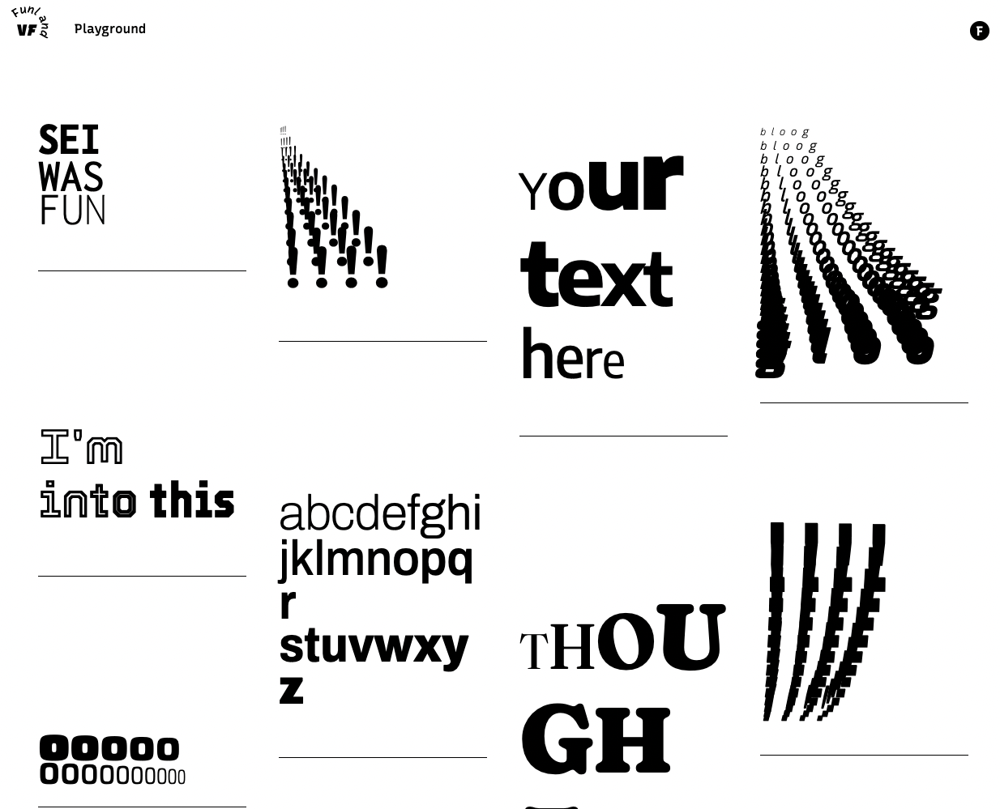
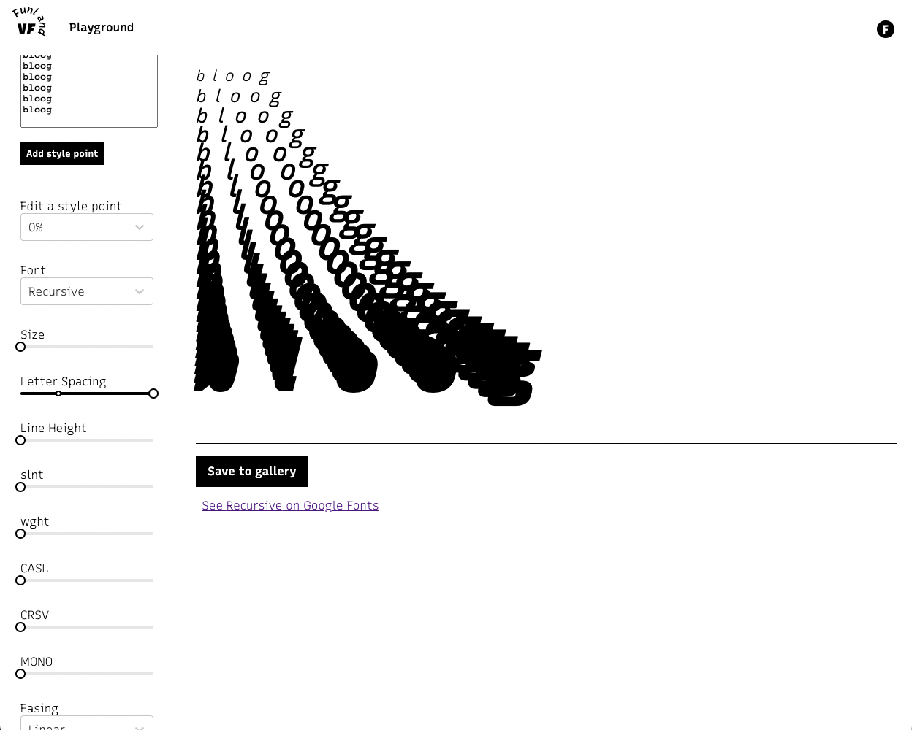

# Variable Font Funland

VF Funland is is web app for playing with variable fonts. 

## [Open the app and play around](https://vffunland.herokuapp.com/)

The app main page shows a gallery of text art that users of the site have created:

Visitors can click on a piece of text art to open it up in the Playground view. Or you can start fresh by clicking on the Playground link at top. While on the playground page, users can enter text, choose from a library of fonts with variable properties, set those properties and add 'style point' to vary those properties within their text snippet. Logged in user can save a piece of text art to add it to the gallery screen:

## Technologies Used

- This project was bootstrapped with [Create React App](https://github.com/facebook/create-react-app).
- Server component is Node/Express talking to Mongo Atlas via Mongoose
- It is deployed on Heroku
- Auth implemented with JWT and bcrypt
- Fonts are served via Google Font's css2 api and loaded on demand with WebFontLoader
- React components from rc-slider, react-masonry-css, react-select and react-textarea-autosize

## Planning
- [Trello Board](https://trello.com/b/ZqWlmlbZ/vf-funland)
- [ERD](https://lucid.app/lucidchart/23d071e7-a07f-450e-96eb-a0a44466b026/edit?page=0_0#)

## Next Steps
- Link to GitHub from app
- List creator and font on gallery page for each piece of 'word art'
- Allow filtering gallery view based on creator and font
- Full user based CRUD
- HTML/CSS export for fonts
- Image download of 'word art'
- Greater selection of fonts
- **Animate between variable states**
- Possibly integrate [Wakamai Fondue](https://wakamaifondue.com/)